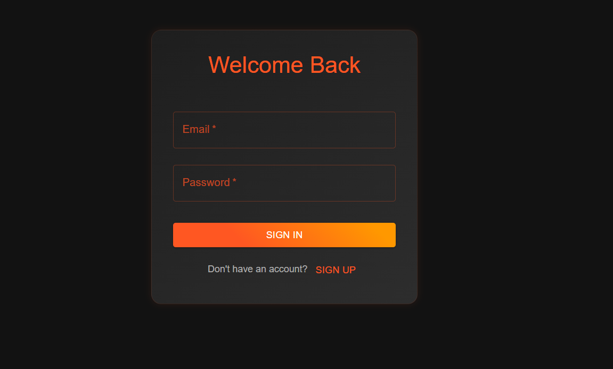
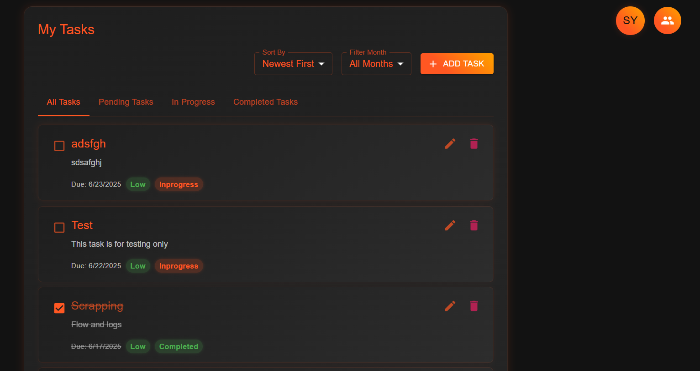
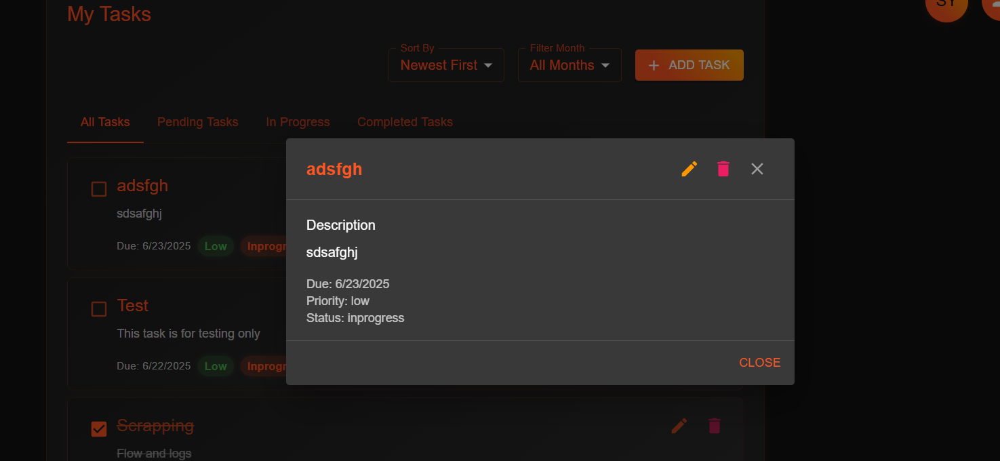

# kaam-kaaz - (Fullstack App)
A web app which helps to plan your day better, tracking your tasks

## Project Description

This is a modern fullstack Task Manager application built with:
- **Frontend:** React (with Material-UI for UI components)
- **Backend:** NestJS (Node.js framework) with TypeORM and a relational database (MySQL/PostgreSQL)

**Features:**
- User authentication (JWT-based)
- Task CRUD (Create, Read, Update, Delete)
- Subtasks/Checklists with progress tracking
- Profile management
- Dark theme UI
- Security best practices (input sanitization, protected routes, etc.)

---

## Prerequisites
- [Node.js](https://nodejs.org/) (v16 or higher recommended)
- [npm](https://www.npmjs.com/) (comes with Node.js)
- [MySQL](https://www.mysql.com/) or [PostgreSQL](https://www.postgresql.org/) database

---

## Step-by-Step Setup Instructions

### 1. **Clone the Repository**
```bash
# Clone the repo
https://github.com/ysachin438/kaam-kaaz.git
cd your-repo
```

### 2. **Install Dependencies**
#### server
```bash
cd server
npm install
```
#### Client
```bash
cd ../Client
npm install
```

### 3. **Configure Environment Variables**
#### Backend
- Copy `.env.example` to `.env` in the `backend` directory (create one if not present):
  ```env
  # Example .env
  JWT_SECRET=your_jwt_secret
  DB_HOST=localhost
  DB_PORT=3306 # or 5432 for Postgres
  DB_USERNAME=your_db_user
  DB_PASSWORD=your_db_password
  DB_DATABASE=your_db_name
  ```
- Edit the values to match your local database setup.

#### Frontend
- (Optional) Create a `.env` file in `client` for API URL:
  ```env
  REACT_APP_API_URL=http://localhost:3000
  ```

### 4. **Set Up the Database**
- Create a new database in MySQL/Postgres (matching your `.env` config).
- Run the migration or manually create tables as per the entities (see `server/src/Users/entities`).

### 5. **Start the Backend Server**
```bash
cd server
npm run start:dev
```
- The backend will run on [http://localhost:3000](http://localhost:3000) by default.

### 6. **Start the Frontend App**
```bash
cd client
npm start
```
- The frontend will run on [http://localhost:3001](http://localhost:3001) by default.

### 7. **Access the App**
- Open [http://localhost:3001](http://localhost:3001) in your browser.
- Sign up, log in, and start managing your tasks!

---

## Security & Production Notes
- **Never commit secrets or `.env` files to git.**
- Restrict CORS in production to your real frontend domain.
- Always use HTTPS in production.
- Sanitize all user input (already implemented in this project).
- Use TypeORM migrations for DB changes in production.

---

## Troubleshooting
- If you see DB errors, check your `.env` and DB connection.
- If you see CORS errors, check your backend CORS config.
- If you see `Module not found: dompurify`, run `npm install dompurify` in the `client` directory.

---

## Screenshots
### Login


### Dashboard


### Task Details Dialog


---


